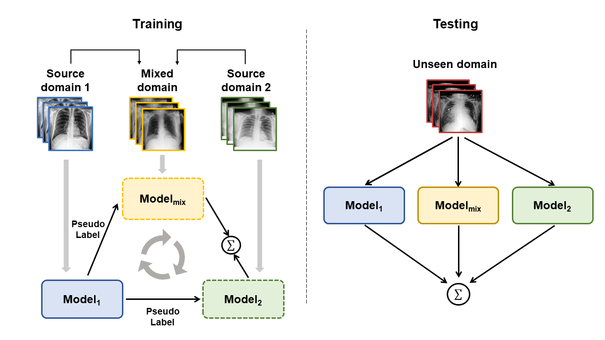

This is the official implementation of the paper "[Domain-ensemble learning with cross-domain mixup for thoracic disease classification in unseen domains](https://www.sciencedirect.com/science/article/abs/pii/S1746809422009429)".

<div align="center">
  
</div>


## Citation
If this code is helpful for your study, please cite:
```bash
@article{WANG2023104488,
title = {Domain-ensemble learning with cross-domain mixup for thoracic disease classification in unseen domains},
journal = {Biomedical Signal Processing and Control},
volume = {81},
pages = {104488},
year = {2023},
issn = {1746-8094},
doi = {https://doi.org/10.1016/j.bspc.2022.104488},
author = {Hongyu Wang and Yong Xia},
keywords = {Thoracic diseases, Image classification, Deep learning, Domain generalization, Chest X-ray}
```